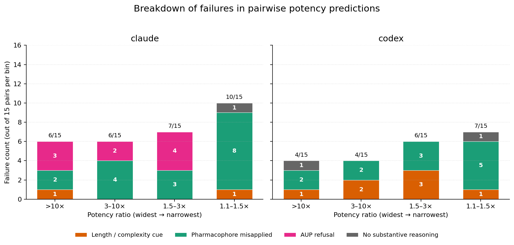

Across the 60 `next_experiment` pairwise-potency tasks (predict the more potent of two peptides from sequence alone), claude and codex produced **50 reasoning failures** between them (29 claude, 21 codex). The dominant failure mode for both agents is **pharmacophore misapplied** — real SAR concepts invoked, wrong conclusion reached.

**Date:** 2026-05-13
**Task type:** `next_experiment` (60 `pilot-peptide-pairwise-sequence-*` tasks)
**Agents:** claude (Sonnet 4.6 via `claude -p`) and codex (`codex exec --json`)

## Setup

Each task presents two peptides from the same receptor family (NPS / OXN / MCH) with only their `peptide_id` and `modification` string. **No EC50, Emax, assay counts, or receptor info beyond the family.** The agent must write `answer.json` with `selected_option` = the `peptide_id` of the more potent peptide.

Gold = the peptide with lower held-out `best_ec50_nm` in `data/processed/invitro_assays.csv`. Difficulty corresponds to the potency ratio between the two peptides, binned into 4 ranges: `>10×`, `3–10×`, `1.5–3×`, `1.1–1.5×`. 5 pairs per (family × ratio bin) → 60 pairs total, 15 per ratio bin.

## Failure mode breakdown

AUP refusals identified by regex; remaining categories assigned by a Haiku 4.5 LLM-judge over `agent_trace.txt`. See `failure_classifications.csv` for the full per-task labels.

| Category | claude (n=29) | codex (n=21) |
|---|---|---|
| Pharmacophore misapplied | **17** (59%) | **12** (57%) |
| AUP refusal | 9 (31%) | 0 |
| Length / complexity cue | 2 (7%) | 7 (33%) |
| No substantive reasoning | 1 (3%) | 2 (10%) |

**Pharmacophore misapplied dominates for both agents.** Both invoke real SAR concepts — pharmacophore residues, stereochemistry, charge, motif positions — and reach the wrong conclusion. This is the failure mode that cannot be fixed by cleaning up the input.

**Failure count climbs as the potency ratio narrows** for both agents (claude: 6 / 6 / 7 / 10; codex: 4 / 4 / 6 / 7 from widest to narrowest), and at the narrowest bin (`1.1–1.5×`) the failures are overwhelmingly pharmacophore_misapplied (8 / 10 for claude, 5 / 7 for codex).

**Codex's length/complexity cue is real but spread across bins** (1 / 2 / 3 / 1) — not concentrated at the narrowest ratio. Claude rarely falls back to length-based reasoning (2 cases total).

**Claude's 9 AUP refusals** (31% of its failures) are a claude-only model-side filter trigger; codex has zero. The benchmark currently cannot distinguish "claude can't do peptide SAR" from "claude refuses peptide tasks." All 9 are on MCH or OXN tasks.

## Failure modes at a glance

Brief description and one representative trace excerpt for each.

#### Pharmacophore misapplied (claude 17/29 = 59%; codex 12/21 = 57%)
The agent invokes real SAR concepts — pharmacophore residues, stereochemistry, charge, motif positions — but reaches the wrong conclusion. This is the failure mode that *isn't* fixable by cleaning the input.

> *Example — `nps-easy-012` (claude), comparing a peptide with one D-Thr substitution to one with four canonical optimizations; gold is the simpler peptide and is 79× more potent:* `"R3 → 4-F-Phe (hydrophobic/aromatic at position 3 — a well-known SAR-driven potency enhancement at NPSR; consistent with the [t-Bu-Ala3]NPS / [Cha3]NPS analog series)."` Real published medicinal chemistry, applied to land on the wrong answer.

The residue-level miss: Claude treated `4-F-Phe` as a generic aromatic/hydrophobic optimization, but in this sequence it replaces native **Arg3** in the NPS `SFRN` activation motif. The simpler gold peptide preserves that N-terminal pharmacophore and only changes Thr13 to D-Thr, while the heavily modified loser removes a conserved cationic contact. The failure is not just "more modifications looked better"; it is modification-count reasoning overriding exact-position accounting.

#### AUP refusal (claude only; 9 of 29)
The agent's safety filter triggers on the peptide-sequence prompt and the agent never engages. Codex never refuses. All 9 occur on MCH or OXN tasks.

> *Example — `mch-trivial-016`:* `"API Error: Claude Code is unable to respond to this request, which appears to violate our Usage Policy..."`

#### Length / complexity cue (codex 7/21 = 33%; claude 2/29 = 7%)
The agent's reasoning leans on sequence length, scaffold size, or sheer number of modifications without engaging with specific residues or mechanism.

> *Example — `oxn-hard-001` (codex), comparing a 14-residue analog with non-natural substitutions to a 28-residue native-like peptide; the shorter analog is 4.5× more potent:* `"The stronger sequence signal is the full-length, native-like OX2R peptide versus the shorter analog with multiple nonstandard substitutions."` No engagement with the specific substitutions; the decision is length-based.

#### No substantive reasoning (claude 1/29; codex 2/21)
The agent picks an answer without articulating biochemical reasoning; the trace contains only boilerplate or filesystem chatter.

> *Example — `oxn-medium-006` (codex), where the loser carries `D-Citrulline` replacing a conserved Arg (a known 14× potency penalty):* `"I'm comparing them against the recognizable orexin-B-like motif and the likely impact of truncation/substitution versus a single noncanonical residue."` No claim about which substitution is worse, no mention of D-Citrulline.

#### Positive control (both agents correct)
For contrast — when the benchmark works as advertised.

> *Example — `nps-hard-001`:* both agents independently identified D-Arg at position 3 as disrupting the conserved SFRNG activation motif and picked against it. Claude: `"D-Arg3 substitution disrupts an essential cationic residue in the SFRNG activation motif"`. Codex: `"the D-Arg substitution at position 3 [is] the larger likely potency penalty for NPSR activation"`. Two-concept SAR, two agents, two correct answers — modest ratio at a known SAR position.
