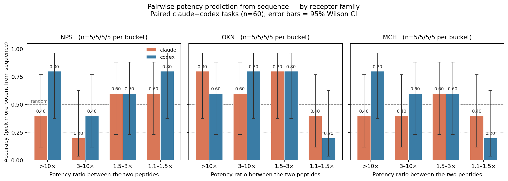
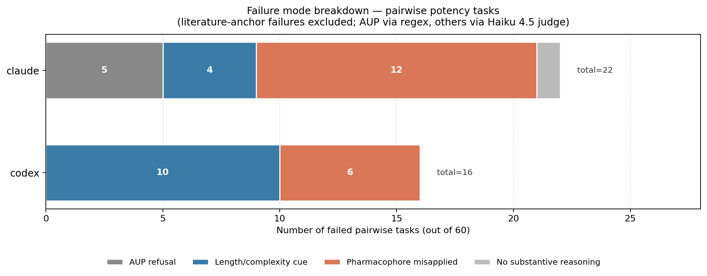
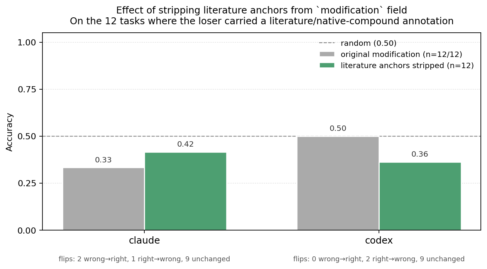

# Pairwise sequence calibration — agents pick by length, not by SAR

**One-liner:** On the 60 `next_experiment` pairwise-potency tasks (predict the more potent of two peptides from sequence alone), claude and codex are above random when the potency ratio is wide and **below random when the ratio is narrow**, with a shared failure mode: both agents systematically pick the *longer / more-modified* peptide when the actual potency difference is small.

**Date:** 2026-05-13
**Task type:** `next_experiment` (the 61 `pilot-peptide-pairwise-sequence-*` tasks; one not yet paired)
**Agents:** claude (Sonnet 4.6 via `claude -p`) and codex (`codex exec --json`)

## Setup

The 60 pairwise tasks present two peptides from the same receptor family (NPS / OXN / MCH) with only their `peptide_id` and `modification` string. **No EC50, Emax, assay counts, or receptor info beyond the family.** The agent must write `answer.json` with `selected_option` = the `peptide_id` of the more potent peptide.

Gold = the peptide with lower held-out `best_ec50_nm` in `data/processed/invitro_assays.csv`. Difficulty corresponds to the potency ratio between the two peptides, binned into 4 ranges: `>10×`, `3–10×`, `1.5–3×`, `1.1–1.5×`. 5 pairs per (family × ratio bin) → 60 pairs total.

## Result

The chart shows accuracy by difficulty bucket for each receptor family, with 95% Wilson CIs.

Pattern across families (ratios go from widest `>10×` to narrowest `1.1–1.5×`):

- **OXN** is the cleanest. Both agents are above random at `>10×` / `3–10×` / `1.5–3×` (0.60–0.80), then collapse to 0.20–0.40 at `1.1–1.5×`. This is the only family where the "accuracy declines as the ratio narrows" story holds for both.
- **MCH** shows codex declining 0.80 → 0.20 as the ratio narrows; claude is flat near random (0.40–0.60) throughout.
- **NPS** shows claude **anti-calibrated**: 0.40 at `>10×`, 0.20 at `3–10×`, 0.60 at narrower ratios. Codex is noisy: 0.80 / 0.40 / 0.60 / 0.80.
- At N=5 per cell, almost all 95% CIs cross 0.5 — most individual points are statistically indistinguishable from random. The *aggregate* pattern (below-random at the narrowest ratio across two of three families for both agents) is the load-bearing signal.

## Failure mode breakdown

38 reasoning-failure cases (literature-anchor failures excluded — those depend on curation of the `modification` field and are being audited via the sanitization probe). AUP refusals identified by regex; remaining categories assigned by a Haiku 4.5 LLM-judge over `agent_trace.txt`. See `failure_classifications.csv` for the full per-task labels (including `literature_anchor`).

| Category | claude (n=22) | codex (n=16) |
|---|---|---|
| AUP refusal | **5** (23%) | 0 |
| Length / complexity cue | 4 (18%) | **10** (62%) |
| Pharmacophore misapplied | **12** (55%) | 6 (38%) |
| No substantive reasoning | 1 (5%) | 0 |

**The agents fail in different shapes.** Codex's dominant failure is *length/complexity cue* (62%) — picking the longer or more-modified peptide without residue-level reasoning. Claude's dominant failure is *pharmacophore misapplied* (55%) — real SAR reasoning that reaches the wrong answer. Claude engages more, but its in-domain knowledge is miscalibrated; codex engages less, and gets caught when surface cues mislead.

Claude has 5 AUP refusals (23% of its failures) — a claude-only model-side filter trigger. Codex has zero.

The shared "longer wins" pattern from the joint-failure analysis below is mostly a codex story. Claude does it less often, but when it doesn't fall back to length it falls back to *textbook pharmacology applied to the wrong dataset* — see case 4 in `case_studies.md`.

## The length/complexity cue, in detail

Across the 15 narrowest-ratio (`1.1–1.5×`) tasks:

| Statistic | Codex | Claude |
|---|---|---|
| Failures (incorrect pick) | 9 / 15 | 8 / 15 |
| Failures that picked the **longer** peptide | **7 / 9** | **6 / 8** |
| Failures that picked the **more-modified** peptide (more `(...)`/`[...]` substitutions) | 6 / 9 | 5 / 8 |
| Tasks where both agents made the **same wrong pick** | **6 / 6** of joint failures | — |
| Tasks where they disagreed on wrong | 0 | — |

A "both wrong with the same wrong pick" rate of 6/6 (versus an independent-error baseline of ~25%) is the cleanest evidence for a shared cue. The two agents are not failing independently — they are converging on the same surface feature.

### Worst case: `mch-hard-005`

| Role | Modification | Length |
|---|---|---|
| Gold winner (3× more potent) | `Ac-Cys-Gly-Arg-Val-Tyr-Cys-NH2` | 30 chars |
| Both agents picked | `Ac-Arg-Cys-Met-Leu-Gly-D-Arg-Val-Tyr-Arg-Pro-Cys-Trp-NH2 (Bednarek 2001 compound 19 scaffold: Ac-MCH...)` | 143 chars |

A small cyclic hexapeptide beats a 4×-longer literature-cited analog. Both agents lose to the length-plus-literature cue.

### Other diagnostic failures

- **`mch-hard-002`**: same 19-mer backbone; loser adds `(N-Me-Nle)` at position 8. Both agents pick the modified one. Adding the modification *reduces* potency here.
- **`nps-hard-002`**: gold is plain `GFRNGVGTGMKKTSFQRAKS-NH2`; both pick the same backbone with `(Nw-Arg)` and `(N-Me-Lys)` added.
- **`oxn-hard-005`**: gold is a substituted sequence; loser has the same substitutions plus visual elaboration (`Ac-`, spaces, additional N-terminal residues). Both pick the more-elaborate-looking option.

## Interpretation

1. At wide potency ratios, the length/complexity heuristic happens to track potency, so agents look competent. As ratios shrink, the heuristic decouples from the true SAR signal — sometimes more elaborate analogs are *less* potent (modifications didn't carry forward in real campaigns) — and the agents fail in the same direction.
2. The benchmark cannot conclude "agents do sequence-aware SAR reasoning" from above-random accuracy at wide ratios. Those wins may be the same wrong heuristic firing in the direction the gold happens to go.
3. The `selected_option` field carries no rationale (pairwise tasks only ask for the pick), so we can't introspect what features the agents claim to be using. To go deeper, grep the saved `agent_trace.txt` files in `runs/pilot-peptide-pairwise-sequence-*-hard-*/` for terms like "longer", "scaffold", "modification", "optimized", "advanced".

## Suggested follow-ups

- **Re-run the `1.1–1.5×` ratio tasks with a calibration prompt** that flags the length/complexity bias (e.g., "Sequence length and number of modifications are not reliable indicators of potency at small ratio differences; modifications can reduce activity"). If accuracy lifts above 0.40, the bias is correctable with prompting.
- **Audit `>10×` ratio *successes*** to see if the high accuracy is driven by the same length cue happening to work by chance. If yes, the apparent wide-ratio competence is illusory.
- **Add controlled probe pairs** where the longer/more-modified peptide is *deliberately* less potent. If both agents drop to ~0% on those, the cue is causal.
- **Drop literature-laden text** from the `modification` field (e.g., remove "Bednarek 2001 compound 19 scaffold" from the loser in `mch-hard-005`) and re-run. Test whether the cue is sequence length or literature anchoring.

## Sanitization probe: are literature anchors actually causal?

For the 12 paired tasks where the loser's `modification` field carries a literature/native-compound annotation (Bednarek 2001, "human orexin A/B 28-mer", etc.), we generated sanitized variants with the annotations stripped while keeping all other chemistry intact (e.g., `(hArg)`, `(D-Arg)`, `(Acetate)`). Probe task IDs: `probe-lit-sanitized-pairwise-*` (generated by `scripts/build_sanitized_pairwise.py`).

| Agent | Original accuracy | Sanitized accuracy | Δ | wrong→right | right→wrong | unchanged |
|---|---|---|---|---|---|---|
| claude | 0.33 (4/12) | 0.42 (5/12) | **+0.08** | 2 | 1 | 9 |
| codex | 0.50 (6/12) | 0.36 (4/11) | **−0.14** | 0 | 2 | 9 |

**Counterintuitive but informative result.** Stripping literature anchors gives claude a small lift (2 wrong→right against 1 regression) but actually *hurts* codex (0 lifts, 2 regressions). Two readings:

1. **Claude has memorized literature SAR; codex does not.** Claude's literature-anchor failures appear to be partly retrieval-driven — when the agent recognizes "Bednarek 2001" and pattern-matches to memorized properties, removing the anchor forces it to reason from chemistry instead, occasionally landing on the right answer. Codex's "literature_anchor"-labeled failures (from the LLM judge) are probably mis-labeled: codex was *citing* the annotation in its trace, not retrieving from it. Without the annotation, codex still picks the longer/more-complex peptide on the same cases.
2. **The cue isn't the annotation per se, it's the chemistry features it co-occurs with.** The Bednarek-annotated MCH peptides are also the *longer* ones in those pairs. Stripping the annotation leaves codex with the same length cue, and the same answer. The annotation was a *correlate* of the cue, not the cue itself.

Implication for benchmark design: removing literature anchors is still a worthwhile cleanup (it removes a retrieval shortcut for claude), but it does **not** materially fix the length/complexity confound for codex. Controlled probes that *invert* the length-vs-potency correlation are needed for that — modifications that make a peptide longer AND less potent within the same family.

See `sanitization_probe.csv` for per-task scores.

## Files in this directory

- `pairwise_sequence_calibration_by_family.png` — per-family bar chart, paired claude+codex runs only.
- `failure_category_breakdown.png` — stacked-bar breakdown of reasoning failures, per agent (literature_anchor excluded).
- `sanitization_probe.png` — pre/post accuracy on tasks with literature anchors stripped.
- `pairwise_paired_by_family.csv` — underlying counts (family × bucket × agent × correct/n).
- `failure_classifications.csv` — per-task failure category (AUP via regex, others via Haiku 4.5 judge over `agent_trace.txt`).
- `sanitization_probe.csv` — per-task pre/post scores for the 12 sanitized tasks.
- `case_studies.md` — one detailed case study per failure mode plus a positive control.
- `README.md` — this document.

## Reproducing

Source data: latest completed `runs/pilot-peptide-pairwise-sequence-*/.../grade.json` for each agent. The plotting/aggregation code is inlined in conversation history and easy to regenerate via `uv run python` with `matplotlib`, `yaml`, and standard library.
