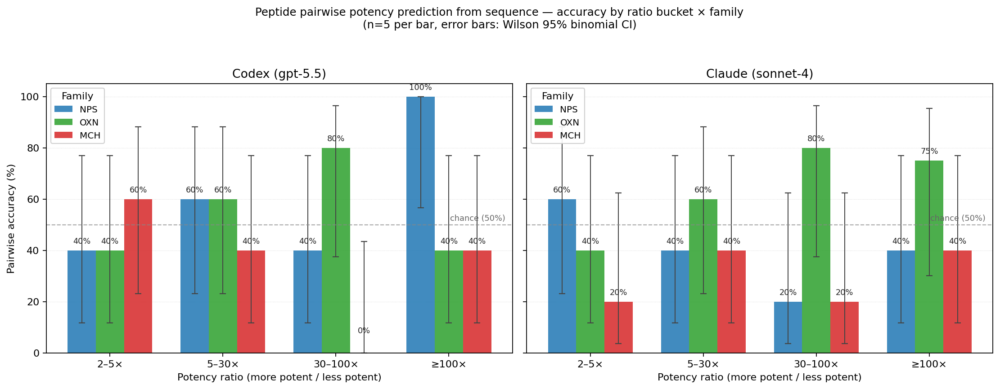

# Peptide pairwise potency prediction from sequence — full-run results

**Date:** 2026-05-13
**Task families:** `pilot-peptide-pairwise-sequence-{nps,oxn,mch}-{hard,medium,easy,trivial}-NN` (60 tasks) + `pilot-peptide-ranking-sequence-{family}-{small,medium,large}-001` (9 tasks)
**Agents:** codex (gpt-5.5 via `@openai/codex` 0.130), claude (sonnet-4 via Claude Code 2.x)
**Backend:** Modal, `max_containers=3`

## Headline

Both frontier agents perform **at or below chance on pairwise potency prediction from sequence alone**, with no clear difficulty gradient by potency ratio. Codex aggregate 30/60 (50%), claude 26/59 (44%). The benchmark's `hard/medium/easy/trivial` ratio buckets do not separate model skill. Ranking is somewhat better, especially for codex (avg P@3 = 0.74).

## Plot



Key features:
- Bars are color-coded by receptor family (NPS / OXN / MCH); error bars are Wilson 95% binomial CIs at n=5.
- Dashed line at 50% (chance).
- **OXN under Claude** is the only clean monotone trend (40% → 60% → 80% → 75%). Claude has real orexin-family SAR knowledge.
- **NPS under codex** is monotone in the top half (40% → 60% → 40% → 100% at ≥100×).
- **MCH is bad for both agents** (codex 7/20 = 35%, claude 6/20 = 30%, both significantly below chance).

## Per-cell counts

Codex (correct / 5):

| Family | 2–5× | 5–30× | 30–100× | ≥100× |
|---|---:|---:|---:|---:|
| NPS | 2 | 3 | 2 | **5** |
| OXN | 2 | 3 | 4 | 2 |
| MCH | 3 | 2 | **0** | 2 |

Claude (correct / 5):

| Family | 2–5× | 5–30× | 30–100× | ≥100× |
|---|---:|---:|---:|---:|
| NPS | 3 | 2 | 1 | 2 |
| OXN | 2 | 3 | 4 | 3/4 |
| MCH | 1 | 2 | 1 | 2 |

Ranking (P@3 / NDCG@3):

| Task | Codex P@3 | Codex NDCG | Claude P@3 | Claude NDCG |
|---|---:|---:|---:|---:|
| nps-small | 0.67 | 0.76 | 0.33 | 0.85 |
| nps-medium | 0.33 | 0.36 | 0.33 | 0.50 |
| nps-large | 0.67 | 0.83 | 0.33 | 0.44 |
| oxn-small | **1.00** | **0.99** | **1.00** | 0.82 |
| oxn-medium | 0.67 | 0.72 | 0.33 | 0.58 |
| oxn-large | **1.00** | 0.82 | 0.33 | 0.80 |
| mch-small | 0.67 | 0.67 | 0.67 | 0.48 |
| mch-medium | **1.00** | 0.82 | 0.67 | 0.87 |
| mch-large | 0.67 | 0.67 | 0.67 | 0.50 |

Codex avg P@3 = **0.74**, claude avg P@3 = **0.52**. Both above the pairwise floor — ranking is materially easier than pairwise.

## Two distinct MCH failure modes

Of the 10 MCH pairs both agents got wrong, the failures split into:

### Pattern A — Format-bias selection (4 cases)

The gold WINNER is a terse delta string (e.g. `D-Arg11`, `Pro15→Ala`); the gold LOSER is a verbose full-sequence string (e.g. `Arg-Cys-Ala-Leu-Gly-Arg-Val-Tyr-Arg-Pro-Cys-Trp`). Both agents pick the verbose one. They are treating "more characters of structure ≈ more characterized ≈ more potent" as a default.

Affected tasks (winner mod / loser mod):
- `mch-hard-001`: `D-Arg11` / `Gua-[Des-Gly10,DLeu9]-MCH(7-17)`
- `mch-hard-003`: `Pro15→Ala` / `Arg-Cys-Met-Ala-Gly-Arg-Val-Tyr-Arg-Pro-Cys-Trp`
- `mch-medium-006`: `D-Arg6,Ava9,10, Ava14,15` / `Arg-Cys-Ala-Leu-Gly-Arg-Val-Tyr-Arg-Pro-Cys-Trp`
- `mch-medium-009`: `Gva6,Gly14,15` / `Ac-Cys-Arg-Val-Tyr-Arg-Cys-NH2`

This is a **data presentation problem** masquerading as an SAR problem. The MCH panel mixes two notation styles: delta-from-parent (literature-derived from Bednarek/Luthin/etc.) vs. full-sequence (cyclic-peptide ground form). Without a parent reference, the deltas are uninterpretable; the agent has nothing to anchor them against and falls back on visual heaviness.

### Pattern B — Genuine wrong SAR intuition (6 cases)

Both peptides are terse deltas. The agents reason about which residue is more critical, applying defensible biochemical intuition, and consistently come out on the wrong side of the gold.

Representative: `mch-easy-011` — `Trp17→Ala` (gold winner, 30× more potent) vs. `D-Cys7` (gold loser). Both agents pick `D-Cys7`. Codex's verbatim reasoning:

> "I'm going to select the `D-Cys7` variant. The alternative removes Trp17, an aromatic C-terminal residue in the MCH sequence context, which is a more obvious loss of receptor-contact chemistry than a stereochemical change at the disulfide-forming Cys7."

The chemistry is biologically defensible but inverted. MCH's Cys6–Cys14 disulfide bridge is more potency-load-bearing than the C-terminal Trp17, so D-Cys substitution (which disrupts the disulfide) is the worse modification. The agents apply "aromatic C-terminal = receptor contact" as a generic GPCR intuition; MCH specifically violates this.

Preserved traces in [traces/](traces/) for codex and claude on `mch-easy-011`, `mch-hard-003`, `mch-medium-006`.

## Other notable structural findings

1. **Codex on NPS at ≥100×: 5/5 = 100%.** The one cell in the pairwise plot that clearly beats chance, and only at this ratio extreme. Suggests codex has good "is this peptide trivially active?" intuition for NPS but no fine-grained SAR.
2. **Codex on MCH at 30–100×: 0/5 = 0%.** Inverted — codex is *systematically* picking the less-potent peptide in this bucket. This is the most diagnostic single result in the run.
3. **Ranking >> pairwise for both agents.** Pairwise forces a binary call with no relative context; ranking lets the model order N peptides against each other, which seems to elicit better SAR judgement. Worth investigating whether pairwise tasks would benefit from "pairwise with a third anchor compound" formulations.

## What to do about this

In rough order of effort:

1. **Normalize the MCH modification field.** Either reconstruct a full-sequence representation from the delta + parent (preferred — requires curator to track the parent reference compound per series) or strip all peptides to a uniform delta-only notation. This dissolves Pattern A.
2. **Reduce stratification on the ratio axis, increase on the modification-type axis.** The ratio buckets don't discriminate; modification-type buckets (lipidated vs. truncation vs. backbone-modified) might.
3. **Increase N per cell** from 5 to ≥25 — the per-cell CIs are too wide to make strong claims without it. Cheap on Modal (~$60 per agent at full run).
4. **Convert pairwise to a "pairwise with anchor" format** where each pair also includes the parent MCH-(7-17) sequence and its EC50. Tests whether agents can do *delta-to-delta* SAR rather than absolute potency prediction.

## Source artifacts

- `pairwise_accuracy.png` — main plot
- `codex_full_summary.json` — full codex run summary (69 tasks)
- `claude_full_summary.json` — full claude run summary (69 tasks)
- `traces/` — agent stdouts + answer.json for representative MCH failures

## Reproducing

```bash
TASK_ARGS=$(ls data/tasks/ | grep -E "peptide-(pairwise|ranking)-sequence" | awk '{printf " --task-id %s", $0}')

# Codex (Modal, throttled)
eval "uv run capablebench run-suite --remote modal --max-containers 3 $TASK_ARGS \
  --runs-dir /abs/path/runs/sat_full_codex \
  --agent-command 'codex exec --json --skip-git-repo-check --cd {task_dir} --dangerously-bypass-approvals-and-sandbox \"\$(cat {prompt_file})\"'"

# Claude (Modal)
eval "uv run capablebench run-suite --remote modal --max-containers 3 $TASK_ARGS \
  --runs-dir /abs/path/runs/sat_full_claude \
  --agent-command 'claude -p --output-format stream-json --verbose --permission-mode bypassPermissions \"\$(cat {prompt_file})\"'"
```

Requires `codex-auth` and `claude-auth` Modal secrets to be set (see `capablebench/modal_app.py`).
